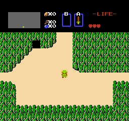

# Quest

This lab builds on the the [Uno Lab], where you learned about Object-Oriented programming. OOP solves problems by creating models of situations, with an object representing each person or thing in the situation. In this lab, you will learn how to use a framwork called *Quest* to make video games. Specifically, *Quest* is a framework for making top-down role-playing games where you control a character and explore a world. [**The Legend of Zelda**](https://en.wikipedia.org/wiki/The_Legend_of_Zelda_(video_game)) (1986) was one of the original top-down role-playing games, and it continues to have a big impact on the style of games today. 



Look at the GIF above from the original Zelda game, and think about the classes
that you would need to make this game. Probably something like:

- **Game** to keep track of everything else
  - **Map** to show the map
    - **Terrain** to represent the bushes and stuff
    - **Monster** for those spiky creatures with tongues
    - **Character** That's you!
  - **Infobar** for the black bar at the top
    - **Minimap** for the small map
    - **Stats** for how much life you have left, etc.

This would take a ton of work! *Quest* is a tool kit (also called a framework) containing commonly-needed
classes for this kind of game. Each class works in a default way, and then you can
customize it to work just the way you want it to. Using tool kits like this can
help you write powerful programs. 

The down side is that you are working with lots and lots of code that you didn't
write. In fact, *Quest* is built using another framework called
[Arcade](https://arcade.academy) for making games of all kinds. Arcade is built on 
top of a framework called [Pyglet](http://pyglet.org/) for making desktop apps
which use the keyboard and mouse, and Pyglet depends on many more layers of 
lower-level stuff. This can quickly get overwhelming, which is why we rely on
**abstraction**. *Quest* is limited, but it's simple. Its goal is to let you make
a certain kind of game without having to learn about all the underlying parts. 

### Reading documentation

Now that you're working with lots of code written by other people, you need to
learn how to read documentation. [Here's a link to the documentation for
*Quest*](http://cs.fablearn.org/docs/quest/); keep this open in a new tab. 

 In fact, before you go any further, have a quick skim over
the *Quest* documentation. The
[Reference](http://cs.fablearn.org/docs/quest/api/index.html) section provides a
list of all the classes in *Quest*. All the contributed modules were written by
CS9 students in previous years!

## Let's play some games

 Let's install the *Quest* framework and try it out. (Note
that we are using `pip` to install Quest, but unlike in the past, we are using
the `--editable` flag so that all of the framework's code is installed right
here where you can mess around with it. 

```shell
cd ~/Desktop/cs9/unit_2
git clone https://github.com/the-isf-academy/quest.git lab-quest
pip install --editable lab-quest
cd lab-quest
python -m quest.examples.island
```

You should find yourself exploring an island. Close the window when you're
tired of exploring. 




Make sure everyone in your group got *Quest* working and was able to play the
example games. 


## Exploring the *Quest* Framework

 Open the worksheet in your Google Drive for this lab. Write an answer to each numbered question below in your Doc.

**Q0.** Before you look at any code, make a prediction about what classes are being used in this game.

✏️ Write this as a list of at least three imagined classes,
where for each class you describe:

- The name of the class
- What it does
- What other classes it interacts with

**Q1.** You may have noticed some of the following features.

✏️ For each, explain how the classes you imagined in **Q0** could make this happen. You can make up new classes if you need to!

- This game is made up of a bunch of little images called *sprites*. The player
  is a sprite, and each patch of background is a sprite. How could the game keep
  track of which background sprites belong where?
- The player is not allowed to walk into the ocean. How could the game enforce
  this rule?
- As the player moves around, the *viewport* scrolls, so that the player can
  never get to the edge of the screen. Which class could make this happen? What
  rule would be applied to get this behavior?

Now we are going to read the code for the game we just played. You can either

- Open `quest/examples/island.py` in Atom
- Or read the code [on the documentation
  website](http://cs.fablearn.org/docs/quest/_modules/quest/examples/island.html#IslandAdventure)

👀 First, skim the whole file. First there are a whole bunch of import statements importing *Quest* classes:

```python
from quest.game import QuestGame
from quest.map import TiledMap
from quest.sprite import Background, Wall
```

Then is a helper function called `resolve_path`--you can ignore this. Next we
have a class called `IslandAdventure`, whose **parent class** is `QuestGame`.
This means `IslandAdventure` inherits all of `QuestGame`'s properties and
methods, which can then be extended or re-defined. *Quest* expects you to create 
**subclasses** of its existing classes, redefining parts of their behavior. 

```python
class IslandAdventure(QuestGame):
    ...
```
 Finally, a statement to run the game:

```python
if __name__ == '__main__':
    game = IslandAdventure()
    game.run()
```

#### Q2.

💻 Try changing some of `IslandAdventure`'s values, saving the file, and running it again.

✏️ What does each of the following do?

- screen_width
- top_viewport_margin
- player_initial_x
- player_speed

#### Q3.
 Open the file `quest/game.py` and look through the `QuestGame` class.
`QuestGame` has a bunch of methods like `setup_maps()`, `setup_walls()`,
`setup_player()`, `setup_npcs()`, and so on. Most of these do almost nothing.
The idea is that subclasses like `IslandAdventure` can override these methods
when they need to. 

Back in the `quest/examples/island.py` file, you can see that `IslandAdventure` overrides two methods from
its parent class, `QuestGame`.

💻 Now play a second version of Island Adventure:

```shell
python -m quest.examples.island_discrete
```
There is a very slight difference in the way the player moves.

✏️ Explain the difference, using the words "continuous" and "discrete" (look 'em up). Then explain how `IslandAdventureDiscrete` achieves this. What class actually determines whether movement is continuous or discrete? Finally, explain why a game might want to use discrete movement like this.

#### Q4.
Above, you looked at the classes that determine how movement works in the game. This movement functionality works for both playable and non-playable characters (NPC).

However, how does a human player control a character's movement? Where is the user interface created in the game?

Find the two functions that handle user input and describe what happens when the UP/W, DOWN/S, LEFT/A, RIGHT/D keys are pressed.

 Fill out the questions in your worksheet.

#### Q5.

 Then, play another sample game:

```shell
python -m quest.examples.grandmas_soup
```
`GrandmasSoup` shows how dialogue can be used in a *Quest* game. There are two main classes that help manage dialogue: `Modal` and `Dialogue`.

👀 Using the source code for these samples and the [Quest documentation](http://cs.fablearn.org/docs/quest),
learn about the `Modal` and `Dialogue` classes.

✏️ Describe the differences between the `Modal` and `Dialogue` classes and what each is responsible for.

Interactions in the game happen when the main `Player` collides with an `NPC`. `GrandmasSoupGame` extends the `NPC` class into two new classes: `Grandma NPC` and `Vegetable NPC`.

✏️ Describe what happens in the `Modal` and `Dialogue` classes when the player collides with one of the extended `NPC` classes.

#### Q6

💻 Play the last sample game:

```shell
python -m quest.examples.maze
```
👀 Read the source code for the `Maze` class. Note how much of it is comments.

💻 Make some sample mazes in a terminal window by opening the python shell and running the following code:

```python
>>> from quest.maze import Maze
>>> m = Maze(55, 15)
>>> m.generate()
>>> print(m)
```
✏️ From reading the code and comments, what makes a maze a maze? What are its properties? What do the two parameters we pass into the `Maze` constructor mean?

The `MazeGame` doesn't change much from the basic `Game` class. However, the module also implements a `MazeMap` class, which holds most changes to run this game.

✏️ How does the `MazeMap` class work with the `Maze` class?

Now it’s your turn create a game! To start, pick something small, just a minor change, so you can get a feel for the framework.

Here are some example features:

* Create a confusing game where the left and right controls are flipped.
* Alter the `Maze` game so there is more or less treasure.
* Change the treasure sprite in the `Maze` game.
* Add more items to the `GrandmasSoup` game.

💻 Implement your game by creating a new module in the examples directory and extending one of the existing games to add a new feature.

